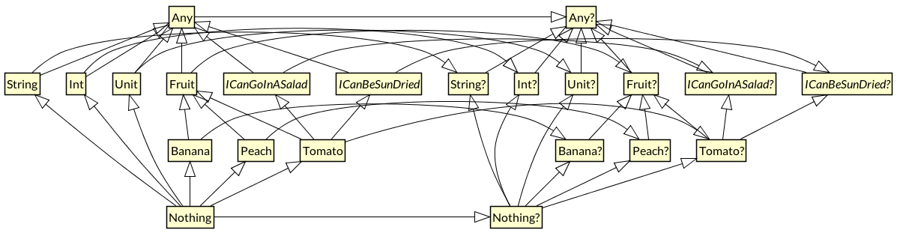

**在Kotlin的类型系统中，`Any?` 是 `Any` 的父类型，而且是所有类型的根类型**


Java 的**stream 只能被消费一次，不可多次重用**。

下面这样的操作会抛出异常：

```java
Stream<Integer> someIntegers = integers.stream();
someIntegers.forEach(...);
someIntegers.forEach(...); // an exception
```

Kotlin 中因为 **操作的中间状态被快速地分配给了变量** ，运行起来并没有任何问题。

Java 8 Stream 一个关键的点是：**它使用了惰性求值（[Lazy Evaluation](https://zh.wikipedia.org/wiki/惰性求值)），即在需要的时候才会求值**。

而 **Kotlin 则相反**（除了 `sequences`，将在 `Lambda` 章节讲述)**，采用及早求值（[Eager Evaluation](https://zh.wikipedia.org/wiki/及早求值)）。**

在对性能有要求的场景下，我们需要 **使用 `asSequence（）` 方法将集合转为惰性序列**，以最小开销来实现业务。


[](http://prefer-tyl.site/images/2017/11/kotlin-types.png)


Java 将 **基本数据类型** 和 **引用类型** 做了区分：

- 基本数据类型，例如 int 的变量直接存储了它的值，我们不能对这些值调用方法，或者把它们放到集合中。
- 引用类型的变量存储的是指向包含该对象的内存地址的引用。


在 Kotlin 中，并不区分基本数据类型和包装类型 —— 你使用的永远是同一类型层级结构的一部分。

**当你使用字面量去初始化一个类型已知的变量，或是把字面量作为实参传给函数时** ，会发生隐式转换，并且算数运算符会被重载。


和 `Object` 作为 Java 类层级结构的顶层类似，`Any` 类型是 Kotlin 中 **所有非空类型**（ex: `String`, `Int`) 的顶级类型——超类。


如果定义了一个没有指定父类型的类型，则该类型将是 `Any` 的直接子类型:

如果你为定义的类型指定了父类型，则该父类型将是新类型的直接父类型，但是新类型的最终祖先为 `Any`。

如果你的类型实现了多个接口，那么它将具有多个直接的父类型，而 `Any` 同样是最终的祖先。


当 Kotlin 函数函数中使用 `Any` 时，它会被编译成 Java 字节码中的 `Object`。


**Kotlin 是一种表达式导向的语言，所有流程控制语句都是表达式**。


`Unit` 并没什么特别之处。就像任何其他类型一样，它是 `Any` 的子类型，而 `Unit?` 是 `Any?` 的子类型。


在 Kotlin 类型层级结构的最底层是 `Nothing` 类型。


注意 `Unit` 和 `Nothing` 之间的区别，对 `Unit` 类型的表达式求值将返回 `Unit` 的单例，而对 `Nothing` 类型的表达式求值则永远都不会返回。

这意味着任何类型为 `Nothing` 的表达式之后的所有代码都是无法得到执行的（unreachable code），编译器和 IDE 会向你发出警告。


什么样的表达式类型为 `Nothing` 呢？[流程控制中与跳转相关的表达式。](https://kotlinlang.org/docs/reference/grammar.html#jump)

例如 `throw` 关键字会中断表达式的计算，并从函数中抛出异常。因此 `throw` 就是 `Nothing` 类型的表达式。

通过将 `Nothing` 作为所有类型的子类型，类型系统允许程序中的任何表达求值失败。

例如: JVM 在计算表达式时内存不足，或者是有人拔掉了计算机的电源插头。这也意味着我们可以从任何表达式中抛出异常。

进入无限循环或杀死当前进程的函数返回类型也为 Nothing。例如 Kotlin 标准库将 `exitProcess` 函数声明为：

```
fun exitProcess(status: Int): Nothing
```


如果你编写返回 `Nothing` 的自定义函数，编译器同样能检查出调用函数后无法得到执行的代码，就像使用语言本身的流程控制语句一样。

```kotlin
inline fun forever(action: ()->Unit): Nothing {
    while(true) action()
}
fun example() {
    forever {
        println("doing...")
    }
    println("done") // Warning: Unreachable code
}
```


与空安全一样，不可达代码分析是类型系统的一个特性。无需像 Java 一样在编译器和 IDE 中使用一些手段进行特殊处理。


`Nothing` 像任何其他类型一样，如果允许其为空则可以得到对应的类型 `Nothing?`。

`Nothing?` 只能包含一个值：`null`。

事实上 `Nothing?` 就是 `null` 的类型。

`Nothing?` 是所有可空类型的最终子类型，所以我们可以使用 null 作为任何可空类型的值。