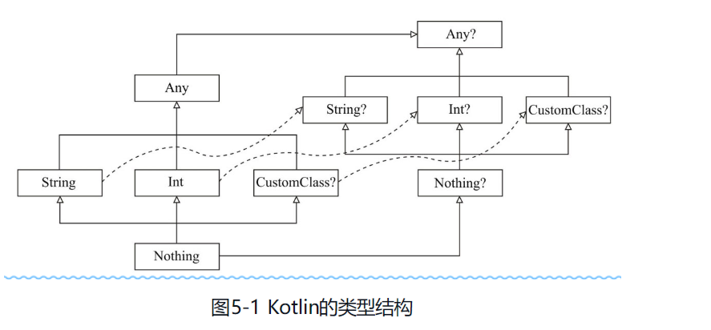
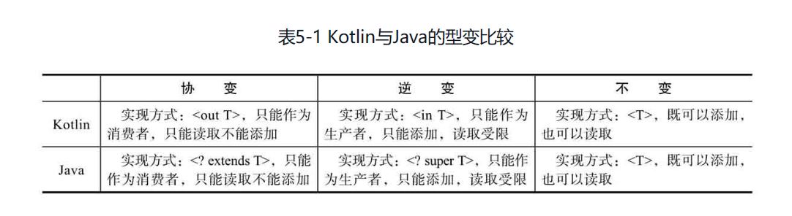

“我把null引用称为10亿美元的错误。它发明于1965年，那时我用一个面向对象的语言（ALGOL W）设计了第一个全面的引用类型系统。”——托尼·霍尔（Tony Hoare）。


如果说类型系统描述了一系列规则，那么null就是类型系统的一个漏洞。

null是一个不是值的值。

它在不同语言中有着不同的名字：NULL、nil、null、None、Nothing、Nil和nullptr等。

大家在使用Java进行开发时，难免会遇到各种异常，不过最令人头疼的莫过于臭名昭著的NullPointerException（NPE）。在数组里、集合中，以及几乎所有的场景中都有它的影子。


首先，我们必须承认的是，一个值为null可以代表很多含义，比如：

❑ 该值从未被初始化；

❑ 该值不合法；

❑ 该值不需要；

❑ 该值不存在。


既然null如此不好，我们为何不彻底废弃它？

正如上文提到，null在1965年就被创造出来了。后来的语言中大多数都沿用了null引用这种设计。然而，如果想要替换掉null，首先我们需要花费大量的精力更新以前的工程；

其次，你需要想出更好的一个代号来代表“空”。这样新的问题就又出现了。


对于防止NPE，当前Java中已经有如下几种解决方案：

1）函数内对于无效值，更倾向于抛异常处理。

2）采用@NotNull/@Nullable标注。

3）使用专门的Optional对象对可能为null的变量进行装箱。


Optional的耗时大约是普通判空的数十倍。

这主要是因为Optional<T>是一个包含类型T引用的泛型类，在使用的时候多创建了一次对象，当数据量非常大的时候，频繁地实例化对象会造成性能损失。

如果未来Java支持了值类（value class），这些开销将会不复存在。


**与Java不同，Kotlin可区分非空（non-null）和可空（nullable）类型**


**由于null只能被存储在Java的引用类型的变量中，所以在Kotlin中基本数据的可空版本都会使用该类型的包装形式。**

**同样，如果你用基本数据类型作为泛型类的类型参数，Kotlin同样会使用该类型的包装形式。**


`type?` 可空类型

`obj.?pro` 安全调用, 当 obj 存在时,才会调用pro

`A ?: B` 当A为空时, 结果为B

`obj.!!pro` 当 obj 不存在时, 直接抛出异常


目前解决NPE问题一般有3种方式：

❑ 用try catch捕获异常。

❑ 用Optional<T>类似的类型来包装。

❑ 用@NotNull/@Nullable注解来标注。

Kotlin 使用在方法参数上标注了@Nullable，在实现上，依旧采用了if..else来对可空情况进行判断。

这么做的原因很可能是：

❑ 兼容Java老版本（兼容Android）；

❑ 实现Java与Kotlin的100%互转换；

❑ 在性能上达到最佳。


Kotlin可空类型优于Java Optional的地方体现在：

❑ Kotlin可空类型兼容性更好；

❑ Kotlin可空类型性能更好、开销更低；

❑ Kotlin可空类型语法简洁。


Kotlin 中的异常处理, 由于 Kotlin 中没有CE, 只靠 ?: 处理异常是很弱的


如果你熟悉Scala，会比较自然地想到用Either[A, B]来解决。

Either只有两个子类型：Left、Right，如果Either[A, B]对象包含的是A的实例，那它就是Left实例，否则就是Right实例。

通常来说，Left代表出错的情况，Right代表成功的情况。

Kotlin虽然没有Either类，但是我们可以通过密封类便捷地创造出Either类： 

```kotlin
sealed class Either<A, B>() {
  class Left<A, B>(val value: A) : Either<A, B>()
  class Right<A, B>(val value: B) : Either<A, B>()
}
```

```kotlin
fun getName(person: Person?): Either<Error, String> {
  return person?.student.let { Either.Right<Error, String>(it.name) } ?: Either.Left<Error, String>(Error(code = -1))
}
```

let的概念

定义: `public inline fun <T, R> T.let(block: (T) -> R): R = block(this)`

功能：调用某对象的let函数，该对象会作为函数的参数，在函数块内可以通过 it 指代该对象。返回值为函数块的最后一行或指定return表达式。


当且仅当Kotlin的编译器确定在类型检查后该变量不会再改变，才会产生SmartCasts。利用这点，我们能确保多线程的应用足够安全。


```kotlin
class Student(val name: String)

fun getStudent(): Student {
  return Student("Simon")
}

class Kot {
  var student: Student? = getStudent()
  fun deal() {
    if (student != null) {
      println(student.name) 
      // Smart cast to 'Scratch.Student' is impossible, because 'student' is a mutable property that could have been changed by this time
    }
  }
}
```

们将stu声明为引用可变变量，这意味着在判断（stu ! = null）之后，stu在其他线程中还是会被修改的，所以被编译器无情地拒绝了。

解决办法如下:

1. var => val 引用不可变能够确保程序运行不产生额外的副作用。

2. 宁愿抛出异常 student!!.name

3. 使用 let

   ```kotlin
   student?.let { println(it.name)}
   ```


在实际开发中，我们并不总能满足Smart Casts的条件。

并且Smart Casts有时会缺乏语义，并不适用于所有场景。

当类型需要强制转换时，我们可以利用“as”操作符来实现。


类型转换: `as`

安全类型转换: `as?`


泛型会出现类型擦除, 需使用 `reified`，我们可以将之理解为“具体化”，利用它我们可以在方法体内访问泛型指定的JVM类对象（注意，还需要在方法前加入inline修饰）。

```kotlin
inline fun <reified T> cast(original: Any): T? = original as? T
```



与Object作为Java类层级结构的顶层类似，Any类型是Kotlin中所有非空类型（如String、Int）的超类

与Java不同的是，Kotlin不区分“原始类型”（primitive type）和其他的类型，它们都是同一类型层级结构的一部分。

如果定义了一个没有指定父类型的类型，则该类型将是Any的直接子类型。

如果你为定义的类型指定了父类型，则该父类型将是新类型的直接父类型，但是新类型的最终根类型为Any。

如果你的类型实现了多个接口，那么它将具有多个直接的父类型，而Any同样是最终的根类型。


Kotlin把Java方法参数和返回类型中用到的Object类型看作Any（更确切地说是当作“平台类型”）。

当在Kotlin函数中使用Any时，它会被编译成Java字节码中的Object。


什么是平台类型？

平台类型本质上就是Kotlin不知道可空性信息的类型，所有Java引用类型在Kotlin中都表现为平台类型。

当在Kotlin中处理平台类型的值的时候，它既可以被当作可空类型来处理，也可以被当作非空类型来操作。

平台类型的引入是Kotlin兼容Java时的一种权衡设计。

试想下，如果所有来自Java的值都被看成非空，那么就容易写出比较危险的代码。反之，如果Java中的值都强制当作可空，则会导致大量的null检查。

综合考量，平台类型是一种折中的设计方案。


如果说Any是所有非空类型的根类型，那么Any？才是所有类型（可空和非空类型）的根类型。

这也就是说，Any？是Any的父类型。


Any？与Any??

一个你可能会挑战的问题是，如果Any？是Any的父类型，那么Any? ？是否又是Any？的父类型？如果成立，那么是否意味着就没有所谓的所有类型的根类型了？

其实，Kotlin中的可空类型可以看作所谓的Union Type，近似于数学中的并集。

如果用类型的并集来表示Any?，可写为Any∪Null。

相应的Any? ？就表示为Any∪Null∪Null，等价于Any∪Null，即Any? ？等价于Any?。

因此，说Any？是所有类型的根类型是没有问题的。


顾名思义，Nothing是没有实例的类型。

Nothing类型的表达式不会产生任何值。

需要注意的是，任何返回值为Nothing的表达式之后的语句都是无法执行的。

你是不是感觉这有点像return或者break的作用？没错，Kotlin中return、throw等（流程控制中与跳转相关的表达式）返回值都为Nothing。

有趣的是，与Nothing对应的Nothing?，我们从字面上翻译可能会解释为：可空的空。

与Any、Any？类似，Nothing？是Nothing的父类型，所以Nothing处于Kotlin类型层级结构的最底层。

其实，它只能包含一个值：null，本质上与null没有区别。

所以我们可以使用null作为任何可空类型的值。


**我们发现，Kotlin中并没有int、float、double、long这样的原始类型，取而代之的是它们对应的引用类型包装类Int、Float、Double、Long。**

除了以上代表数值的类型，还有布尔（Boolean）、字符（Char）、字符串（String）及数组（Array）。这让Kotlin比起Java来更加接近纯面向对象的设计——一切皆对象。


自动装箱基本类型自动转为包装类，自动拆箱指包装类自动转为基本类型。

❑ Kotlin中的Int类型等同于int；

❑ Kotlin中Int？等同于Integer。

Int作为一种小技巧，让Int看起来是引用类型，这在语法上让Kotlin更接近纯面向对象语言。


在Kotlin中，还为原始类型额外引入了一些实用的类：IntArray、CharArray、ShortArray等，分别对应Java中的int[ ]、char[ ]、short[ ]等。

由于Kotlin对原始类型有特殊的优化（主要体现在避免了自动装箱带来的开销），所以我们建议优先使用原始类型数组。


总的来说，泛型有以下几点优势：

❑ 类型检查，能在编译时就帮你检查出错误；

❑ 更加语义化，比如我们声明一个List<String>，便可以知道里面存储的是String对象，而不是其他对象；

❑ 自动类型转换，获取数据时不需要进行类型强制转换；

❑ 能写出更加通用化的代码。


Java使用extends关键字，而Kotlin使用“:”，这种类型的泛型约束，我们称之为上界约束。

```kotlin
class FruitPlate<T: Fruit>(val t: T)

//多个泛型约束
fun <T> cut(t: T) where T: Fruit, T: Ground {}
```

我们可以通过where关键字来实现这种需求，它可以实现对泛型参数类型添加多个约束条件，比如这个例子中要求被切的东西是一种水果，而且必须是长在地上的水果。


```java
Fruit[] fruits = appleArray // 通过
List<Fruit> fruits = appleList // 不通过
```

这里涉及一个关键点，数组是协变的，而List是不变的。

简单来说，就是Object[]是所有对象数组的父类，而List<Object>却不是List<T>的父类。


Java中的泛型是类型擦除的，可以看作伪泛型，简单来说，就是你无法在程序运行时获取到一个对象的具体类型。

数组在运行时是可以获取自身的类型，而List<Apple>在运行时只知道自己是一个List，而无法获取泛型参数的类型。

而Java数组是协变的，也就是说任意的类A和B，若A是B的父类，则A[]也是B[]的父类。

但是假如给数组加入泛型后，将无法满足数组协变的原则，因为在运行时无法知道数组的类型。


Kotlin中的泛型机制与Java中是一样的，所以上面的特性在Kotlin中同样存在。

不同的是，Kotlin中的数组是支持泛型的，当然也不再协变，也就是说你不能将任意一个对象数组赋值给Array<Any>或者Array<Any? >。在Kotlin中Any为所有类的父类


一般在没有泛型的语言上支持泛型，一般有两种方式，以集合为例：

❑ 全新设计一个集合框架（全新实现现有的集合类或者创造新的集合类），不保证兼容老的代码，优点是不需要考虑兼容老的代码，写出更符合新标准的代码；缺点是需要适应新的语法，更严重的是可能无法改造老的业务代码。

❑ 在老的集合框架上改造，添加一些特性，兼容老代码的前提下，支持泛型。

很明显，Java选择了后种方式实现泛型，这也是有历史原因的，主要有以下两点原因：

1）在Java1.5之前已经有大量的非泛型代码存在了，若不兼容它们，则会让使用者抗拒升级，因为他要付出大量的时间去改造老代码；

2）Java曾经有过重新设计一个集合框架的教训，比如Java 1.1到Java1.2过程中的Vector到ArrayList, HashTable到HashMap，引起了大量使用者的不满。

所以，Java为了填补自己埋下的坑，只能用一种比较别扭的方式实现泛型，那便是类型擦除。


既然泛型在编译后是会擦除泛型类型的，那么我们又为什么可以使用泛型的相关特性，比如类型检查、类型自动转换呢？

类型检查是编译器在编译前就会帮我们进行类型检查，所以类型擦除不会影响它。

类型自动转换是使用强制类型转换完成的.


虽然Java受限于向后兼容的困扰，使用了类型擦除来实现了泛型，但它还是通过其他方式来保证了泛型的相关特性。


通常情况下使用泛型我们并不在意它的类型是否是类型擦除，但是在有些场景，我们却需要知道运行时泛型参数的类型，比如序列化/反序列化的时候。

可以主动指定参数类型来达到运行时获取泛型参数类型的效果(将类型信息保存起来)

```java
class Data<T>(val info: T, val clazz: Class<T>) {}

val info = Data("Simon", String::class.java)
info.clazz // class java.lang.String
```


但是这种方式也有限制，比如我们就无法获取一个泛型的类型，比如：

```kotlin
Map<String,String>::class.java //不允许
```

还有没有另外的方式能获取各种类型的信息呢？有，那就是利用匿名内部类。

```kotlin
val list = object : ArrayList<String>() {}
//java.util.ArrayList<java.lang.String>
list.javaClass.genericSuperclass
```

为什么使用匿名内部类的这种方式能够在运行时获取泛型参数的类型呢？

其实泛型类型擦除并不是真的将全部的类型信息都擦除，还是会将类型信息放在对应class的常量池中的。

在Kotlin中除了用这种方式来获取泛型参数类型以外，还有另外一种方式，那就是内联函数。

Kotlin中的内联函数在编译的时候编译器便会将相应函数的字节码插入调用的地方，也就是说，参数类型也会被插入字节码中，我们就可以获取参数的类型了。

```kotlin
inline fun <reified T> getType() { 
	return T::class.java
}
```

使用内联函数获取泛型的参数类型非常简单，只需加上reified关键词即可。

这里的意思相当于，在编译的会将具体的类型插入相应的字节码中，那么我们就能在运行时获取到对应参数的类型了。


另外需要注意的一点是，Java并不支持主动指定一个函数是否是内联函数，所以在Kotlin中声明的普通内联函数可以在Java中调用，因为它会被当作一个常规函数；

**而用reified来实例化的参数类型的内联函数则不能在Java中调用，因为它永远是需要内联的。**


在定义的泛型类和泛型方法的泛型参数前面加上out关键词，说明这个泛型类及泛型方法是协变，

简单来说类型A是类型B的子类型，那么Generic<A>也是Generic<B>的子类型，

比如在Kotlin中String是Any的子类型，那么List<String>也是List<Any>的子类型，

所以List<String>可以赋值给List<Any>。

支持协变的List只可以读取，而不可以添加。

其实从out这个关键词也可以看出，out就是出的意思，可以理解为List是一个只读列表。

在Java中也可以声明泛型协变，用通配符及泛型上界来实现协变：<? extends Object>，其中Object可以是任意类。


通常情况下，若一个泛型类Generic<out T>支持协变，那么它里面的方法的参数类型不能使用T类型，因为一个方法的参数不允许传入参数父类型的对象，因为那样可能导致错误。

但在Kotlin中，你可以添加@UnsafeVariance注解来解除这个限制，比如上面List中的indexOf等方法。


逆变 in: 假若类型A是类型B的子类型，那么Generic<B>反过来是Generic<A>的子类型

所以我们就可以将一个numberComparator作为doubleComparator传入。


用out关键字声明的泛型参数类型将不能作为方法的参数类型，但可以作为方法的返回值类型，

而in刚好相反。我们不能将泛型参数类型当作方法返回值的类型，但是作为方法的参数类型没有任何限制，其实从in这个关键词也可以看出，in就是入的意思，可以理解为消费内容，

在Java中使用<? super T>可以达到相同效果。


in和out是一个对立面，其中in代表泛型参数类型逆变，out代表泛型参数类型协变。

从字面意思上也可以理解，in代表着输入，而out代表着输出。

但同时它们又与泛型不变相对立，统称为型变，而且它们可以用不同方式使用。




如果你对泛型参数的类型不感兴趣，那么你可以使用类型通配符来代替泛型参数。

前面已经接触过Java中的泛型类型通配符“? ”，而在Kotlin中则用“*”来表示类型通配符。

通配符只是一种语法糖，背后上也是用协变来实现的。

所以MutableList<*>本质上就是MutableList<out Any? >，使用通配符与协变有着一样的特性。