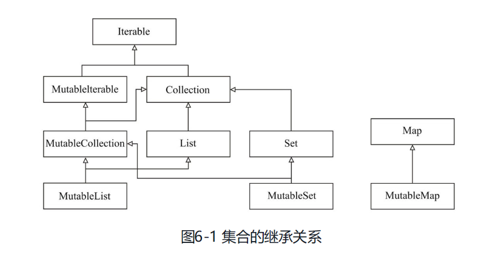
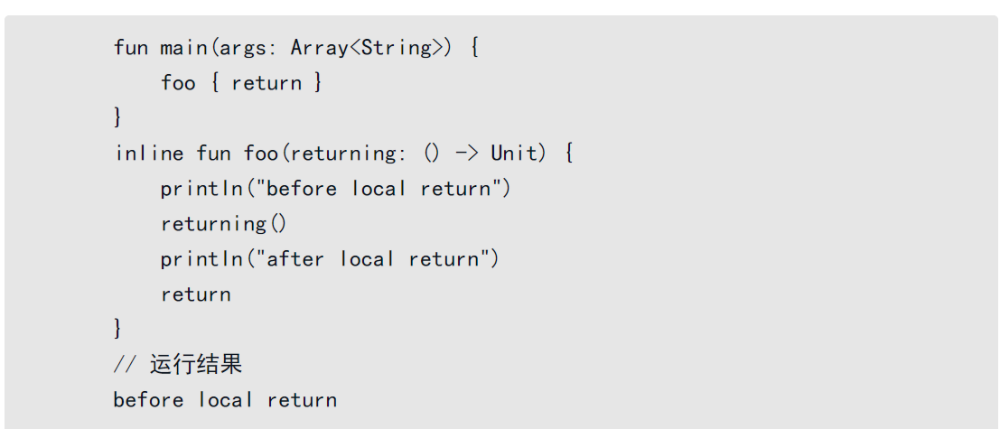
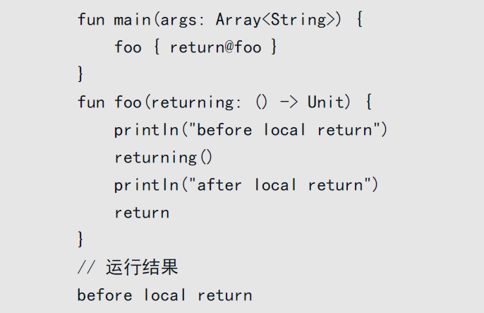
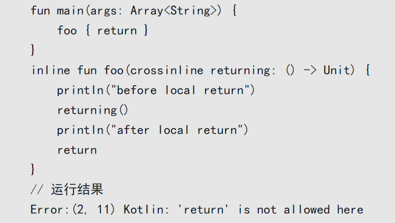
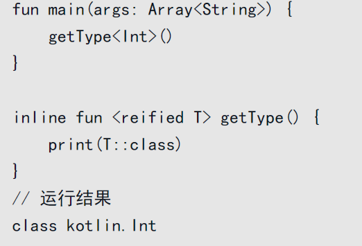

Kotlin允许对Java的类库做一些优化，任何函数接收了一个Java的SAM（单一抽象方法）都可以用Kotlin的函数进行替代。

而 Kotlin 中的函数可以使用 Lambda 表达式来描绘.


新语法--带接收者的Lambda

```kotlin
val sum: Int.(Int) -> Int = { other -> this + other }
2.sum(1) //3
```


另一种神奇的语法,类型安全构造器.

```kotlin
class HTML {
  fun body() {
    println("body fun is called")
  }
}
// init === 带接收者的Lambda
// 同时也可以看成一种规范定义, 规范了函数中的html对象具有的init方法
fun html(init: HTML.() -> Unit): HTML {
  val h = HTML() // 创建了接受者对象
  h.init()	// 把接收者对象传递给Lambda
  return h
}

html {
  body() // 等同于 this.body()
}
```


Kotlin的库中还实现了两个非常好用的函数：with和apply。

将它们与带接收者的Lambda结合，可以在某些场合进一步简化语法。

这两个方法最大的作用就是可以让我们在写Lambda的时候，省略需要多次书写的对象名，默认用this关键字来指向它。

其他同类方法如下: 

`<R> run(block: () -> R): R`

```kotlin
val r = run {
  println("run")
  100
}
r // 100
```

`<T, R> T.run(block: T.() -> R): R`

```kotlin
val r = "Hello".run {
  startsWith("H")
} // run 的参数就是 接收者的一个方法, 自然就可以使用接收者的其他api 这样
r // true 
```

`<T, R> T.let(block: (T) -> R): R`

```kotlin
val r = "Hello".let { h ->
  h.startsWith("H")
}
r // true
```

`<T> T.apply(block: T.() -> Unit): T`

```kotlin
"Hello".apply {
  println(startsWith("H")) // true
}.apply {
  println(this) // Hello
}
```

`<T> T.also(block: (T) -> Unit): T`

```kotlin
"Hello".also { h ->
  println(h) // Hello
}
```

`<T, R> with(receiver: T, block: T.() -> R): R = receiver.block()`

```kotlin
val r = with("Hello") {
  startsWith("H")
}
r // true
```

`<T> T.takeIf(predicate: (T) -> Boolean): T? = if (predicate(this)) this else null`

`<T> T.takeUnless(predicate: (T) -> Boolean): T? = if (!predicate(this)) this else null`

`repeat(times: Int, action: (Int) -> Unit) = for (index in 0 until times) action(index)`


`fold` 与 `reduce` 很像, fold 可以指定初始值, reduce 使用第一个元素作为初始值

`groupBy` 可以元素的属性进行分组, 返回一个 Map

`flatMap{ it.name } === flatten().map { it.name }` 




每一个集合都分为两种，一种为带Mutable前缀的，另一种则是不带的。

比如我们常见的列表就分为MutableList和List, List实现了Collection接口，MutableList实现了MutableCollection和List（MutableList表示可变的List，而List则表示只读的List）。

Kotlin的可变集合与只读集合的区别其实就是，Kotlin将可变集合中的修改、添加、删除等方法移除之后，原来的可变集合就变成了只读集合。

只读集合 也是可以改变的:

1. `val readList: List<Int> = MutableList<Int>对象`

2. kotlin 使用 java 定义的方法

   

Set表示一个不可重复的集合，Set常用的具体实现有两种，分别为HashSet和TreeSet。

HashSet是用Hash散列来存放数据的，不能保证元素的有序性；

而TreeSet的底层结构是二叉树，它能保证元素的有序性。

在不指定Set的具体实现时，我们一般说Set是无序的。


Kotlin中的Map与其他集合有点不同，它没有实现Iterable或者Collection。

```kotlin
mapOf(1 to 2)
```


在编程语言理论中，惰性求值（Lazy Evaluation）表示一种在需要时才进行求值的计算方式。

在使用惰性求值的时候，表达式不在它被绑定到变量之后就立即求值，而是在该值被取用时才去求值。

通过这种方式，不仅能得到性能上的提升，还有一个最重要的好处就是它可以构造出一个无限的数据类型。


```kotlin
list.asSequence().filter { it > 2 }.map { it * 2 }.toList()
```

其中`filter, map`都是中间操作, 是不会执行的, 需要调用末端操作`toList`

在不使用序列的情况下, 需要执行`o(n^2)` , 使用序列后 只需执行`o(n)`

就是第1个元素执行了filter之后再去执行map，然后第2个元素也是这样。


无限序列

```kotlin
val naturalNumList = generateSequence(0) { it + 1 }
naturalNumList.takeWhile { it <= 9 }.toList()
```


与Kotlin的序列不同，Java 8中的流是一次性的。

意思就是说，如果我们创建了一个Stream，我们只能在这个Stream上遍历一次。

这就和迭代器很相似，当你遍历完成之后，这个流就相当于被消费掉了，你必须再创建一个新的Stream才能再遍历一次。

Java 8中的流非常强大，其中有一个非常重要的特性就是Java 8 Stream能够在多核架构上并行地进行流的处理, 只需要将stream换成paralleStream即可。

并行处理数据这一特性是Kotlin的序列目前还没有实现的地方，如果我们需要用到处理多线程的集合还需要依赖Java。


**Kotlin中使用Lambda表达式会带来一些额外的开销。**

Kotlin中的内联函数显得有点尴尬，因为它之所以被设计出来，主要是为了优化Kotlin支持Lambda表达式之后所带来的开销。

在Java 7之后，JVM引入了一种叫作invokedynamic的技术，它会自动帮助我们做Lambda优化。

在Kotlin中每声明一个Lambda表达式，就会在字节码中产生一个匿名类。

该匿名类包含了一个invoke方法，作为Lambda的调用方法，每次调用的时候，还会创建一个新的对象。

可想而知，Lambda语法虽然简洁，但是额外增加的开销也不少。

尤其对Kotlin这门语言来说，它当今优先要实现的目标，就是在Android这个平台上提供良好的语言特性支持。

如果你熟悉Android开发，肯定了解Java 6是当今Android主要采用的开发语言，Kotlin要在Android中引入Lambda语法，必须采用某种方法来优化Lambda带来的额外开销，也就是内联函数。


与Kotlin这种在编译期通过硬编码生成Lambda转换类的机制不同，Java在SE 7之后通过invokedynamic技术实现了在运行期才产生相应的翻译代码。

在invokedynamic被首次调用的时候，就会触发产生一个匿名类来替换中间码invokedynamic，后续的调用会直接采用这个匿名类的代码。

这种做法的好处主要体现在：

❑ 由于具体的转换实现是在运行时产生的，在字节码中能看到的只有一个固定的invokedynamic，所以需要静态生成的类的个数及字节码大小都显著减少；

❑ 与编译时写死在字节码中的策略不同，利用invokedynamic可以把实际的翻译策略隐藏在JDK库的实现，这极大提高了灵活性，在确保向后兼容性的同时，后期可以继续对翻译策略不断优化升级；

❑ JVM天然支持了针对该方式的Lambda表达式的翻译和优化，这也意味着开发者在书写Lambda表达式的同时，可以完全不用关心这个问题，这极大地提升了开发的体验。


invokedynamic固然不错，但Kotlin不支持它的理由似乎也很充分。

我们有足够的理由相信，其最大的原因是Kotlin在一开始就需要兼容Android最主流的Java版本SE 6，这导致它无法通过invokedynamic来解决Android平台的Lambda开销问题。

Kotlin拥抱了内联函数，在C++、C#等语言中也支持这种特性。

简单来说，我们可以用inline关键字来修饰函数，这些函数就成为了内联函数。

它们的函数体在编译期被嵌入每一个被调用的地方，以减少额外生成的匿名类数，以及函数执行的时间开销。


内联函数典型的一个应用场景就是Kotlin的集合类。

如果你看过Kotlin的集合类API文档或者源码实现就会发现，集合函数式API，如map、filter都被定义成内联函数


内联函数不是万能的

以下情况我们应避免使用内联函数：

❑ 由于**JVM对普通的函数已经能够根据实际情况智能地判断是否进行内联优化**，所以我们并不需要对其实使用Kotlin的inline语法，那只会让字节码变得更加复杂；

❑ **尽量避免对具有大量函数体的函数进行内联，这样会导致过多的字节码数量；**

❑ 一旦一个**函数被定义为内联函数，便不能获取闭包类的私有成员**，除非你把它们声明为internal。


如果在一个函数的开头加上inline修饰符，那么它的函数体及Lambda参数都会被内联。

然而现实中的情况比较复杂，有一种可能是函数需要接收多个参数，但我们只想对其中部分Lambda参数内联，其他的则不内联，这个又该如何处理呢？


解决这个问题也很简单，Kotlin在引入inline的同时，也新增了noinline关键字，我们可以把它加在不想要内联的参数开头，该参数便不会具有内联的效果。


Kotlin中的内联函数除了优化Lambda开销之外，还带来了其他方面的特效，典型的就是**非局部返回和具体化参数类型。**


非局部返回:




另外一种等效的方式，是通过标签利用@符号来实现Lambda非局部返回。




注意! 非局部返回尤其在循环控制中显得特别有用，比如Kotlin的forEach接口，它接收的就是一个Lambda参数，由于它也是一个内联函数，所以我们可以直接在它调用的Lambda中执行return退出上一层的程序。

```kotlin
fun foo() {
  list.forEach {
    if (it < 2) {
      println(it)
      return@forEach // 退出当前的循环
    }
    if (it < 4) {
      return // 直接返回函数的结果
    }
  }
}

foo() // 1
```


非局部返回虽然在某些场合下非常有用，但可能也存在危险。

因为有时候，我们内联的函数所接收的Lambda参数常常来自于上下文其他地方。

为了避免带有return的Lambda参数产生破坏，我们还可以使用`crossinline`关键字来修饰该参数，从而杜绝此类问题的发生。




Kotlin与Java一样，由于运行时的类型擦除，我们并不能直接获取一个参数的类型。

然而，由于内联函数会直接在字节码中生成相应的函数体实现，这种情况下我们反而可以获得参数的具体类型。

我们可以用reified修饰符来实现这一效果。

