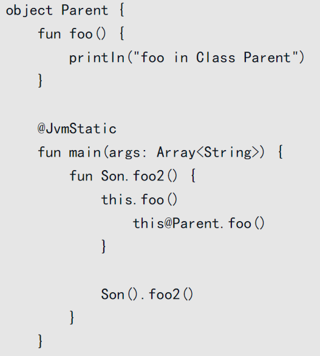

熟悉Java的读者对多态应该不会陌生，它是面向对象程序设计（OOP）的一个重要特征。

当我们用一个子类继承一个父类的时候，这就是子类型多态（Subtype polymorphism）。

另一种熟悉的多态是参数多态（Parametric polymorphism），我们在第5章所讨论的泛型就是其最常见的形式。

此外，也许你还会想到C++中的运算符重载，我们可以用特设多态（Ad-hocpolymorphism）来描述它。

相比子类型多态和参数多态，可能你对特设多态会感到有些许陌生。

其实这是一种更加灵活的多态技术，在Kotlin中，一些有趣的语言特性，如运算符重载、扩展都很好地支持这种多态。


除了子类型多态、参数多态以外，还存在一种更灵活的多态形式——特设多态（Ad-hocpolymorphism）。


运算符重载

```kotlin
data class Area(val value: Double)

operator fun Area.plus(that: Area): Area {
  return Area(this.value + that.value)
}

Area(1.0) + Area(2.0) // Area(value=3.0)
```

operator，它的作用是：将一个函数标记为重载一个操作符或者实现一个约定。

常见的运算符重载:

| `+a` | `a.unaryPlus()`  |
| ---- | ---------------- |
| `-a` | `a.unaryMinus()` |
| `!a` | `a.not()`        |

| 表达式  | 翻译为                             |
| :------ | :--------------------------------- |
| `a + b` | `a.plus(b)`                        |
| `a - b` | `a.minus(b)`                       |
| `a * b` | `a.times(b)`                       |
| `a / b` | `a.div(b)`                         |
| `a % b` | `a.rem(b)`、 `a.mod(b)` （已弃用） |
| `a..b`  | `a.rangeTo(b)`                     |

https://www.kotlincn.net/docs/reference/operator-overloading.html


在修改现有代码的时候，我们应该遵循开放封闭原则，即：软件实体应该是可扩展，而不可修改的。

也就是说，对扩展开放，而对修改是封闭的。

开放封闭原则（OCP, Open Closed Principle）是所有面向对象原则的核心。

软件设计本身所追求的目标就是封装变化、降低耦合，而开放封闭原则正是对这一目标的最直接体现。

其他的设计原则，很多时候是为实现这一目标服务的，例如以替换原则实现最佳的、正确的继承层次，就能保证不会违反开放封闭原则。


```kotlin
fun MutableList<Int>.exchange(formIndex: Int, toIndex: Int) {
  val tmp = this[formIndex]
  this[formIndex] = this[toIndex]
  this[toIndex] = tmp
}
```

Kotlin严格区分了接收者是否可空。

如果你的函数是可空的，你需要重写一个可空类型的扩展函数。


我们可以将扩展函数近以理解为静态方法。

而熟悉Java的读者应该知道静态方法的特点：它独立于该类的任何对象，且不依赖类的特定实例，被该类的所有实例共享。

此外，被public修饰的静态方法本质上也就是全局方法。

综上所述，我们可以得出结论：扩展函数不会带来额外的性能消耗。


当扩展方法在一个Class内部时，我们只能在该类和该类的子类中进行调用。


扩展属性:

```kotlin
var MutableList<Int>.sumIsEven: Boolean
  get() = this.sum() % 2 == 0
  set(value) {
    println(value)
  }

 val list = MutableList(5) { it }
println(list.sumIsEven) // true
list.sumIsEven = false // false
println(list.sumIsEven) // true
```

注意, 扩展属性不能有初始默认值

扩展属性 在编译后 也会和扩展方法一样 变成静态方法


伴生对象的扩展属性和扩展方法

```kotlin
class Person {
  companion object {}
}

val Person.Companion.name: String
  get() = "Simon"

fun Person.Companion.say() = "Hello"

fun main() {
  println(Person.name)
  println(Person.say())
}
```


**同名的类成员方法的优先级总高于扩展函数。**


当在扩展函数里调用this时，指代的是接收者类型的实例。

那么如果这个扩展函数声明在一个object内部，我们如何通过this获取到类的实例呢？



**我们可以用this@类名来强行指定调用的this。**

另外值得一提的是：如果Son扩展函数在Parent类内，我们将无法对其调用。


Kotlin是一种静态类型语言，我们创建的每个对象不仅具有运行时，还具有编译时类型

在使用扩展函数时，要清楚地了解静态和动态调度之间的区别。


扩展函数几个需要注意的地方：

❑ 如果该扩展函数是顶级函数或成员函数，则不能被覆盖；

❑ 我们无法访问其接收器的非公共属性；

❑ 扩展接收器总是被静态调度。