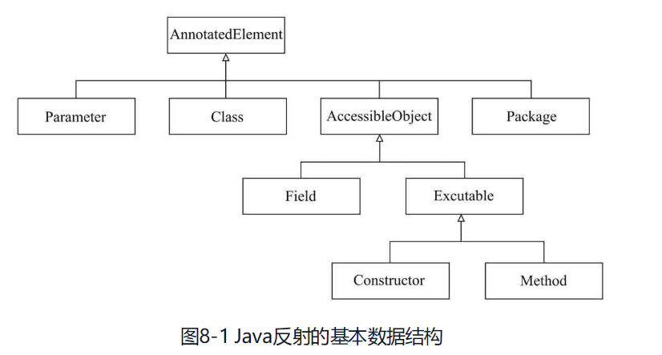
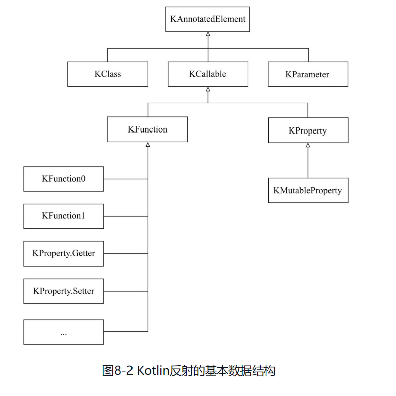
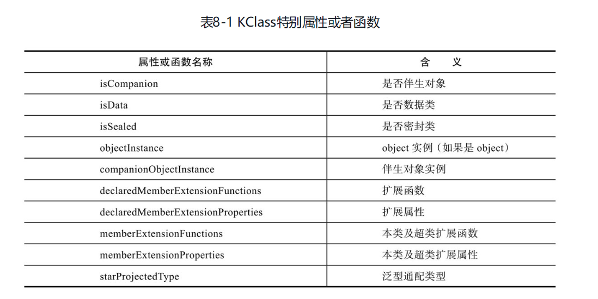
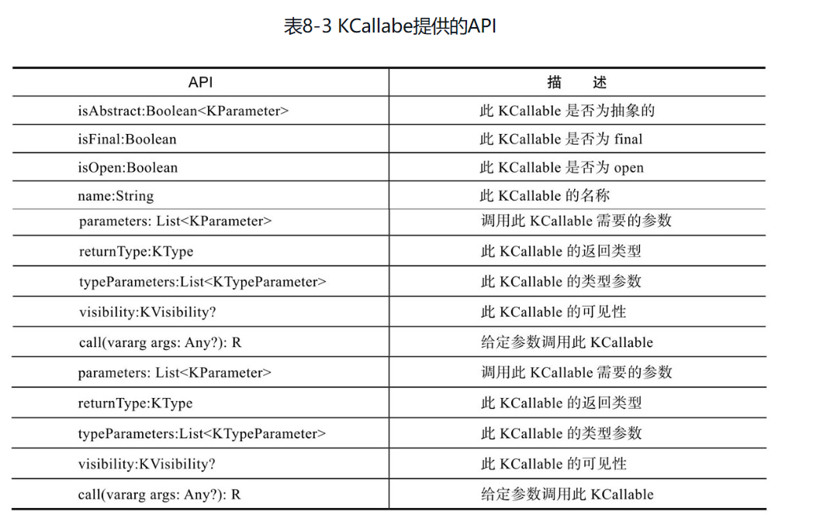
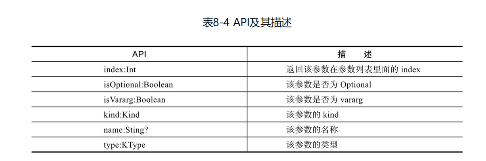
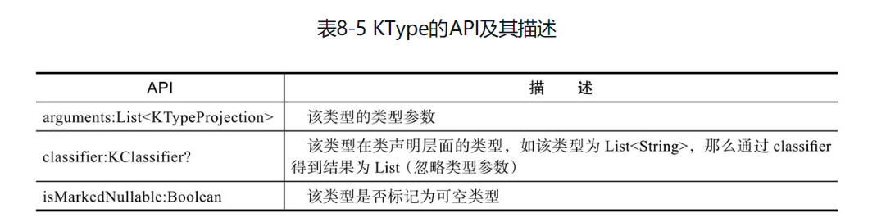
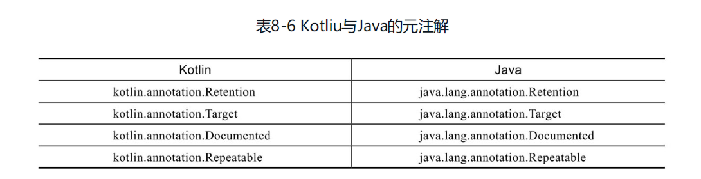
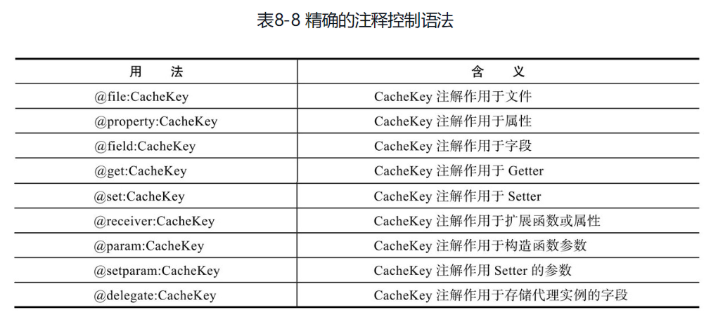
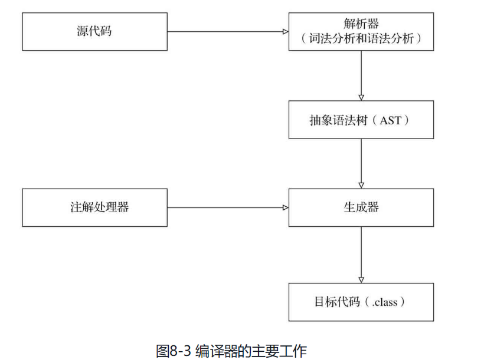

描述数据的数据可以称之为元数据。

操作元数据的编程就可以称之为元编程。


说了这么多，元编程不就是反射吗？

这个说法是不全面的，元编程可以用一句话概括：**程序即是数据，数据即是程序**。

❑ 前半句指的是访问描述程序的数据，如我们通过反射获取类型信息；

❑ 后半句则是指将这些数据转化成对应的程序，也就是所谓代码生成。


仔细思考之后不难发现，元编程就像高阶函数一样，是一种更高阶的抽象，高阶函数将函数作为输入或输出，而元编程则是将程序本身作为输入或输出。


同时我们也会思考，元数据经过操作之后能不能直接作为程序使用？

也就“程序即数据，数据即程序”这句话中前后的数据是否指的是同一种数据。


对于这个问题不同语言有不同答案，在Kotlin中我们显然没法将一个KClass修改之后将其反过来生成一个新的class来使用；

但是在Lisp中，一切都可以视为LinkedList，而Lisp的宏则允许直接将这些LinkedList作为程序的一部分。

像Lisp这样的一致性，我们称之为同像性（homoiconicity）。

同像性在计算机编程中，同像性（homoiconicity，来自希腊语单词homo，意为与符号含义表示相同）是某些编程语言的特殊属性，它意味着一个程序的结构与其句法是相似的，因此易于通过阅读程序来推测程序的内在涵义。

如果一门编程语言具备了同像性，说明该语言的文本表示（通常指源代码）与其抽象语法树（AST）具有相同的结构（即，AST和语法是同形的）。该特性允许使用相同的表示语法，将语言中的所有代码当成资料来存取以及转换，提供了“代码即数据”的理论前提。


1）元编程是指操作元数据的编程。

它通常需要获取程序本身的信息或者直接生成程序的一部分或者两者兼而有之。

2）元编程可以消除某些样板代码。


常见的元编程技术:

❑ 运行时通过API暴露程序信息。我们多次提及的反射就是这种实现思路。

还有编译时的反射机制,编译期反射通常需要和宏等技术结合使用，编译器将当前程序的信息作为输入传入给宏，并将其结果作为程序的一部分。

❑ 动态执行代码。多见于脚本语言，如JavaScript就有eval函数，可以动态地将文本作为代码执行。

❑ 通过外部程序实现目的。

如编译器，在将源文件解析为AST之后，可以针对这些AST做各种转化。

这种实现思路最典型的例子是我们常常谈论的语法糖，编译器会将这部分代码AST转化为相应的等价的AST，这个过程通常被称为desuger（解语法糖）。


什么是AST?

抽象语法树是源代码语法结构的一种抽象表示。

它以树状的形式表现编程语言的语法结构，树上的每个节点都表示源代码中的一种结构。

之所以说语法是“抽象”的，是因为这里的语法并不会表示出真实语法中出现的每个细节。

比如，嵌套括号被隐含在树的结构中，并没有以节点的形式呈现；

而类似于if-condition-then这样的条件跳转语句，可以使用带有两个分支的节点来表示。（维基百科）


反射，有时候也称为自反，是指**元语言（即前文提到的描述程序的数据结构）和要描述的语言是同一种语言的特性。**

Kotlin中的KClass就是如此，它是一个Kotlin的类，同时它的实例又能作为描述其他类的元数据。像这样用Kotlin描述Kotlin自身信息的行为就是所谓的反射或者自反。

不难看出，自反实际上更贴合这个定义，也容易理解。

除了Kotlin和Java以外，还有许多编程语言，如Ruby、Python等都支持反射技术。

除了我们熟悉的运行时反射之外，也有许多语言支持编译期反射，编译期反射通常需要和宏等技术结合使用，编译器将当前程序的信息作为输入传入给宏，并将其结果作为程序的一部分。


C语言的宏简单粗暴, Lisp和Scala这样的语言中的宏更加强大，如前文所说，它们会直接在宏展开时暴露抽象语法树（AST），你可以在宏定义中直接操作这些AST，并生成需要的AST作为程序返回。

还有C++的模板元编程,能够操作C++中的类型。


Kotlin既然声称能100%兼容Java，那自然也是支持所有Java支持的反射特性。

首先通过两张图来对比Kotlin和Java反射基本数据结构，如图8-1、图8-2所示。





观察以上二图不难发现：

1）Kotlin的KClass和Java的Class可以看作同一个含义的类型，并且可以通过．java和．kotlin方法在KClass和Class之间互相转化。

2）Kotlin的KCallable和Java的AccessiableObject都可以理解为可调用元素。

Java中构造方法为一个独立的类型，而Kotlin则统一作为KFunction处理。

3）Kotlin的KProperty和Java的Field不太相同。

Kotlin的KProperty通常指相应的Getter和Setter（只有可变属性Setter）整体作为一个KProperty（通常情况Kotlin并不存在字段的概念），而Java的Field通常仅仅指字段本身。


尽管Kotlin的反射和Java非常相似，但是它仍旧有一些独特的地方，主要是集中在Kotlin中独有，Java没有与之对应的特性。

KClass的特别属性或者函数如表8-1所示。




在上文和Java对比的时候我们提到Kotlin把Class中的属性（Property）、函数（Funciton）甚至构造函数都看作KCallable，因为它们是可调用的，它们都是Class的成员。

那我们如何获取一个Class的成员呢？

幸运的是，上文提到的KClass给我们提供了一个members方法，它的返回值就是一个Collection<KCallable<*>>。

接下来看看KCallabe为我们提供了哪些有用的API，如表8-3所示。



通过对KCallable的API的浏览，你会发现，这些API和Java中的反射的API很相似，都是对KCallable（Class成员）的信息的获取。

你可能对call这个函数理解得不够透彻，其实它就是通过反射执行这个KCallable对应的逻辑

值得注意的是，如果KCallable代表的是扩展函数，则除了传入对象实例外还需要额外传入接收者实例。


有时候，我们不仅想使用反射来获取一个类的属性，还想更改它的值，

在Java中可以通过Field.set(...)来完成对字段的更改操作，但是在Kotlin中，并不是所有的属性都是可变的，因此我们只能对那些可变的属性进行修改操作。

通过图8-2我们知道，KMutableProperty是KProperty的一个子类，

那我们如何识别一个属性是KMutableProperty还是KProperty呢？我们使用when表达式可以轻松解决这个问题。

```kotlin
import kotlin.reflect.KMutableProperty
import kotlin.reflect.full.memberProperties

data class Person(var name: String)

val p = Person("Simon")

val props = p::class.memberProperties

props.forEach { prop ->
  when (prop) {
    is KMutableProperty<*> -> prop.setter.call(p, "Leann")
    else -> prop.call(p)
  }
}

p // Person(name=Leann)
```

关于KMutableProperty的API，发现只比KProperty多了一个setter函数。


Kotlin把参数分为3个类别，分别是函数的参数（KParameter）、函数的返回值（KType）及类型参数（KTypeParameter）。

下面我们就来看看如何获取它们及它们的用法。


使用KCallabel.parameters即可获取一个List<KParameter>，它代表的是函数（包括扩展函数）的参数。让我们先来浏览一下它的API，如表8-4所示。




```kotlin
Person::class.members.forEach {
  println(it.name)
  it.parameters.forEach {
    println(it.type)
  }
  println()
}
```

对于属性和无参数的函数，它们都有一个隐藏的参数为类的实例，而对于声明参数的函数，类的实例作为第1个参数，而声明的参数作为后续的参数。

对于那些从Any继承过来的参数，Kotlin默认它们的第1个参数为Any。

值得一提的是，Java中尝试获取参数名有可能返回arg0、arg1，而不是代码中指定的参数名称。若要获得参数名则可能需要指定-parameters编译参数。


我们用KParameter的type属性获得KCallable的参数类型，现在我们来看看如何获得KCallable的返回值类型。

每一个KCallabe都可以使用returnType来获取返回值类型，它的结果类型是一个KType，代表着Kotlin中的类型。




对于函数和类来说，还一个重要的参数——类型参数，

在KClass和KCallable中我们可以通过typeParameters来获取class和callable的类型参数，它返回的结果集是List<KTypeParameter>，

不存在类型参数时就返回一个空的List。


前面我们提及过注解kotlin.Metadata，这是实现Kotlin大部分独特特性反射的关键，Kotlin将这些信息直接以注解形式存储在字节码文件中，以便运行时反射可以获取这些数据。

由于Kotlin兼容Java，所以所有Java可以添加注解的地方，Kotlin也都可以。

并且Kotlin也简化了注解创建语法，创建注解就像创建class一样简单，只需额外在class前增加annotation关键字即可。


有了注解之后我们就可以将注解应用在代码中。

那么哪些代码可以添加注解呢？熟悉Java的读者应该已经想到了@Target元注解，它可以指定注解作用的位置。

类似@Target这样标注在注解上的注解我们称之为元注解。

Java有下列5个元注解。

❑ Documented文档（通常是API文档）中必须出现该注解。

❑ Inherited如果超类标注了该类型，那么其子类型也将自动标注该注解而无须指定。

❑ Repeatable这个注解在同一位置可以出现多次。

❑ Retention表示注解用途，有3种取值。

​	❑ Source。仅在源代码中存在，编译后class文件中不包含该注解信息。

​	❑ CLASS。class文件中存在该注解，但不能被反射读取。

​	❑ RUNTIME。注解信息同样保存在class文件中并且可以在运行时通过反射获取。

❑ Target表明注解可应用于何处。


Kotlin也有相应类似的元注解在kotlin.annotation包下，如表8-6所示。




和Java一样，Kotlin的注解可以出现代码的各个位置，例如方法、属性、局部变量、类等。

此外注解还能作用于Lambda表达式、整个源文件。


```kotlin
annotation class Cache(val namespace: String, val expires: Int)
annotation class CacheKey(val keyName: String, val buckets: IntArray)

@Cache(namespace = "Hello", expires = 3600)
data class Hero(
  @CacheKey(keyName = "heroName", buckets = intArrayOf(1, 2, 3))
  val name: String
)
```

细心的你可能已经发现，Kotlin的代码常常会表达多重含义。

例如，上述例子中的name除了生成了一个不可变的字段之外，实际上还包含了Getter，同时又是其构造函数的一个参数。

这就带来一个问题，@CacheKey注解究竟是作用于何处？


为了解决这个问题，Kotlin引入精确的注解控制语法，

如表8-8所示。假如我们有注解annotation class CacheKey。



```kotlin
@Cache(namespace = "Hello", expires = 3600)
data class Hero(
  @property: CacheKey(keyName = "heroName", buckets = intArrayOf(1, 2, 3))
  val name: String,
  @field: CacheKey(keyName = "atk", buckets = intArrayOf(1, 2, 3))
  val attack: Int
)
```


代码标记上注解之后，注解本身也成了代码的一部分，我们自然而然就会想到如何利用这些注解信息。

Kotlin当然也提供方法获取注解信息。

1. 通过反射获取注解信息

   这有一个前提就是这个注解的Retentaion标注为Runtime或者没有显示指定（注默认为Runtime）。

   ```kotlin
   @Cache(namespace = "Hello", expires = 3600)
   data class Hero(
     @property: CacheKey(keyName = "heroName", buckets = intArrayOf(1, 2, 3))
     val name: String,
     @field: CacheKey(keyName = "atk", buckets = intArrayOf(1, 2, 3))
     val attack: Int
   )
   
   val cacheAnnotation = Hero::class.annotations.find { it is Cache } as Cache?
   
   cacheAnnotation?.namespace // Hero
   cacheAnnotation?.expires // 3600
   ```

   显而易见，通过反射获取注解信息是在运行时发生的，和Java一样存在一定的性能开销，当然这种开销大部分时候可以忽略不计。

   此外前面提到的注解标准位置也会影响注解信息的获取。

   例如@file:CacheKey这样标准的注解，则无法通调用KProperty.annotions获取到该注解信息。

2. 注解处理器

   **众所周知，JSR269引入了注解处理器（annotation processors），允许我们在编译过程中挂钩子实现代码生成。**

   **得益于此，如dagger之类的框架实现了编译时依赖注入这样原本只能通过运行时反射支持的特性。**

   

这里本来应该是代码生成的最佳场合，理论上应该可以实现对AST进行修改，然而JSR269是只读API，这就限制了你不能修改任何传入注解处理器的AST。

如果要实现代码生成，只能非常蹩脚地将代码以字符串形式写入另一个文件，这不得不说是一个非常大的遗憾。


比较遗憾的是，Kotlin目前和Java一样没有简单优雅的代码生成方案，开发人员要么通过注解处理器手工将代码写入文件，要么直接依赖javac的tree api牺牲可移植性。

这两种方案不管哪种都不是很理想，使用起来颇为费力。