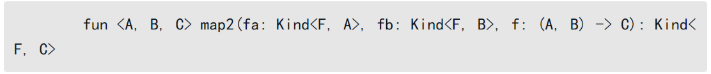
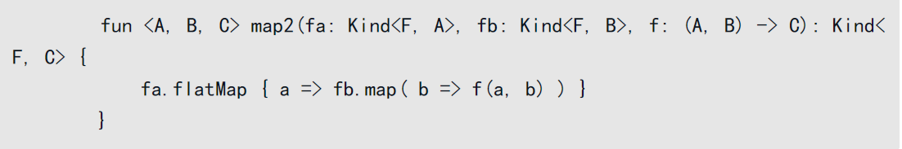
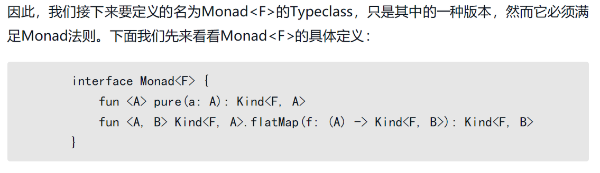
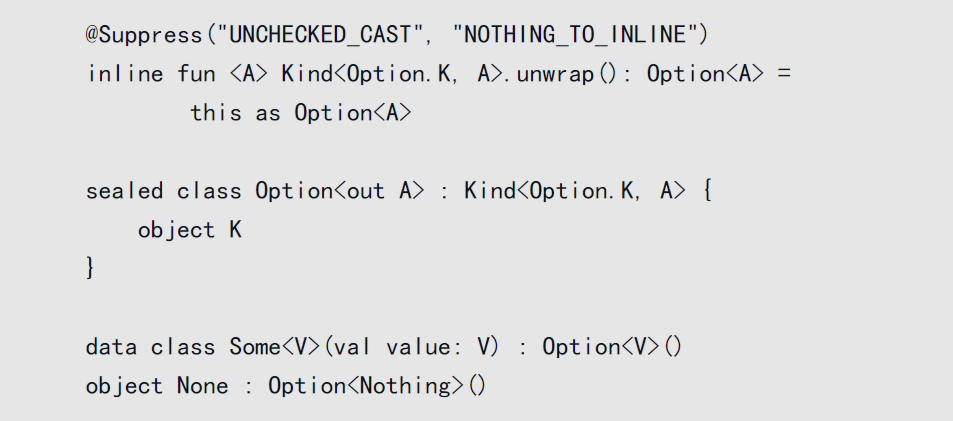
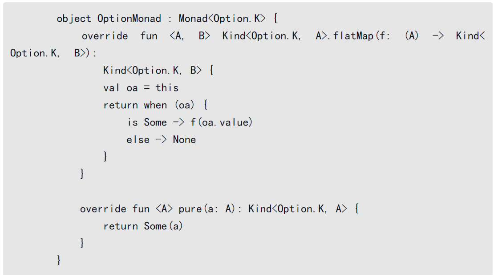

# 函数式编程的探索

## 前言

Kotlin是一门集成面向对象与函数式的多范式语言，但它并没有像Scala那样彻底拥抱函数式编程。

相对地，Kotlin仅是克制地采纳了部分基础的函数式语言特性，如高阶函数、（部分）模式匹配的能力等。

究其原因，是因为高度函数式化的编程方式是一种截然不同的思维，这与Kotlin的设计哲学相悖，因为它的定位是成为一门“更好的Java语言”。


尽管Kotlin并没有直接支持函数式语言的某些高级特性，如Typeclass、高阶类型，但它的扩展却是一种非常强大的语言特性，利用它我们同样可以实现函数式编程中一些高级的数据结构和结构转换功能。


函数式语言: Haskell、ML或Lisp Scala、Clojure


**函数式是一种更加抽象的编程思维方式，它所做的事情就是高度抽象业务对象，然后对其进行组合。**


函数式编程思想的背后理论，是一套被叫作范畴论的学科。

范畴论是抽象地处理数学结构以及结构之间联系的一门数学理论，以抽象的方法来处理数学概念，将这些概念形式化成一组组“物件”及“态射”。


### 狭义的函数式语言

我们可以从狭义和广义两个方面去解读所谓的函数式语言。

所谓狭义的函数式语言，有着非常简单且严格的语言标准，即**只通过纯函数进行编程，不允许有副作用。**

这是以Haskell为代表的纯函数式语言所理解的函数式编程，你会发现在狭义的函数式语言中进行编程，纯函数就像是数学中函数一样，给它同样的输入，会有相同的输出，因此程序也非常适合推理.

然而，纯函数式的编程语言也有着一些明显的劣势，典型的就是绝对的无副作用，以及所有的数据结构都是不可变的。这使得它在设计一些如今我们认为非常简单的程序的时候，也变得十分麻烦，如实现一个随机数函数。


因此，站在纯函数式语言肩膀上发展过来的更现代化的编程语言，如Scala和Kotlin，都允许了可变数据的存在，我们仍然可以在程序代码中拥有“状态”。

此外，它们也都继承了Java中面向对象的特性。

因此，在纯函数式语言的信徒看来，Scala、Kotlin这些语言并不能称为真正意义上的函数式语言。

### 广义的函数式语言

同时，也有很多人对此并不赞同。

在他们看来，**所谓函数式编程语言，不应该只是严格的刻板标准，它应该根据需求的变化而发展。**Scala的作者马丁就针对“函数式语言之争”的话题，发表过一篇文章来阐明类似的观点。

在他看来，Scala这种拥有更多语言特性选择的编程语言，是一种“后函数式”的编程语言，即它在几乎拥有所有函数式编程语言特性的同时，又符合了编程语言发展的趋势。

**从广义上看，任何“以函数为中心进行编程”的语言都可称为函数式编程。**

**在这些编程语言中，我们可以在任何位置定义函数，同时也可以将函数作为值进行传递。**


广义的函数式编程语言并不需要强调函数是否都是“纯”的，我们来列举一些最常见的函数式语言特性：

❑ 函数是头等公民；

❑ 方便的闭包语法；

❑ 递归式构造列表（list comprehension）；

❑ 柯里化的函数；

❑ 惰性求值；

❑ 模式匹配；

❑ 尾递归优化。

如果是支持静态类型的函数式语言，那么它们还可能支持：

❑ 强大的泛型能力，包括高阶类型；

❑ Typeclass；

❑ 类型推导。

Kotlin支持以上具有代表性的函数式语言特性列表中的绝大多数，因此它可以被称为广义上的函数式语言。


## 副作用与纯函数

编程中的纯函数十分接近于数学中的函数，因此它的评判标准也是来源于数学中的一个基本原则，那就是需要具备**引用透明性**。

关于引用透明性，我们不打算深究它在数学中的精确定义，你可以把这一原则简单地理解为

：**一个表达式在程序中可以被它等价的值替换，而不影响结果。**

当谈论一个具体的函数时，如果它具备引用透明性，只要它的输入相同，对应的计算结果也会相同。

**“计算结果”不仅针对返回结果值。**

**假使一个函数具备引用透明性，那么它内部的行为不会改变外部的状态。**

如unsafeInterpreter中的print操作，每次执行都会在控制台打印信息，所以具有副作用行为的函数也违背了引用透明性原则。


纯函数:

1. **不改变外部的数据** (引用透明性)
2. **内部行为不会影响到外部** (没有副作用) 
3. 每次相同的输入, 都有相同的输出 (幂等性)


好处:

1. 便于测试
2. 易于组合

这些特点构成了函数式编程的一个非常大的优点，就是近似于数学中的等式推理。


典型的非纯函数: 

- `Array.sort()` 修改了外部数据, 不具备引用透明性

- `println` 内部行为已经影响到了外部

- `random()` 不具备幂等性

  

**当我们讨论副作用时，需要将话题限定在一定的抽象层次，因为没有绝对的“无副作用”。**

**即使是纯函数，也会使用内存，占用CPU。**


### 局部可变性

函数式编程倡导我们使用纯函数来编程，促进这一过程的一大语言特性就是不可变性


当我们谈论引用透明性的时候，需要结合上下文来解读。

foo函数具备局部可变性，但当它被外部执行调用的时候，函数整体会被看成一个黑盒，程序依旧符合引用透明性。

局部可变性有时候能够让我们的程序设计变得更加自然，性能更好。

所以，函数式编程并不意味着拒绝可变性，相反，合理地结合可变性和不可变性，能够发挥更好的作用。


### 惰性求值

```kotlin
fun f1(x:Int,y:Int) = x
fun f2(x:Int):Int = f2(x)

f1(1,f2(2))
```

也许你至今未曾思考过这个问题：编程语言中的表达式求值策略是怎样的？

**其实，编程语言中存在两种不同的代换模型：应用序和正则序。**

大部分我们熟悉的语言如Kotlin、C、Java是“应用序”语言，

当要执行一个过程时，就会对过程参数进行求值，这也是上述Kotlin代码导致死循环的原因：

当我们调用f1(1, f2(2))的时候，程序会先对f2(2)进行求值，从而不断地调用f2函数。


然而，Haskell采用了不一样的逻辑，它会延迟对过程参数的求值，直到确实需要用到它的时候，才进行计算，这就是所谓的“正则序”，是一个惰性求值的过程。

当我们调用f1(1(f2(2))后，由于f1的过程中压根不需要用到y，所以它就不会对f2(2)进行求值，直接返回x值，也就是1。


**Haskell是默认采用惰性求值的语言，在Kotlin和其他一些语言中（如Scala和Swift），我们也可以利用lazy关键字来声明惰性的变量和函数。**

惰性求值可以带来很多优势，如“无限长的列表结构”。

当然，它也会制造一些麻烦，比如它会让程序求值模型变得更加复杂，滥用惰性求值也会导致效率下降。


最典型的惰性求值 就是将一个函数包一层.

这也是惰性的，也是可替代的。这样，我们就可以在程序中将函数进行组合，最后再执行它们。


## Typeclass

假使类型也能像函数一样支持高阶，也就是可以通过类型来创造新的类型，那么多阶类型就可以上升到更高的抽象，从而进一步消除冗余的代码，这便是我们接下来要谈论的高阶类型（higher-orderkind）。


函数还有另一种衍生概念, 值构造器（value constructor）

> 给一个值, 返回一个值

这就叫做 一阶函数(一阶值构造器)

高阶函数: 可以支持传入一个值构造器，或者返回另一个值构造器。

Kotlin 支持高阶函数.


类型构造器的概念就是, 给一个类型参数, 返回一个类型.

就比如常见的 List<Int> , Set<Int>,给一个`Int`类型参数, 返回List<Int>类型

高阶类型: 支持传入构造器变量，或构造出另一个类型构造器。

Kotlin 只支持一阶类型构造器

> 类型(接口,类,类型别名,基础类型)理解成变量, 泛型理解成针对类型的函数

高阶类型示例:

```kotlin
interface Iterable<T, Container<X>>
// Container<X> 是针对类型形参 X 的一阶类型构造器, 类型函数

interface Iterable<T, Container<X>> {
  fun filter(p: (T)->Boolean): Container<T>
  fun remove(p: (T)->Boolean): Container<T> = filter { x -> !p(x) }
}

interface List<T>: Iterable<T, List>
interface Set<T>: Iterable<T, Set>
```

```kotlin
fun List(T: Type): Type = List<T>
fun Set(T: Type): Type = Set<T>

fun Iterable(T: Type, Container: (Type) -> Type): Type {
  return Container<T>
}

val IntList = Iterable(Int, List)
```


众所周知, 如果一个函数，可以接受函数作为参数或者返回值，那么它就是所谓的高阶函数(higher ordered function)。

那么高阶类型的概念就很显然了,


事实上，在Haskell中高阶类型的特性天然催生了这门语言中一项非常强大的语言特性——Typeclass。

Kotlin不支持高阶类型

庆幸的是Jeremy Yallop和Leo White曾经在论文《Lightweight higher-kindedpolymorphism》中阐述了一种模拟高阶类型的方法。


高阶类型本质上是非常简陋的类型函数, 具体行为只是类型组合, 去创造深一层的抽象.

如果语言不支持高阶类型特性, 那么通过自定义类型, 很容易创建一个虚拟的高阶类型.

具体代码: Kind <Func,T> 再加上 Func 具体后的行为.

并且无论是否是高阶还是低阶的类型, 根本上还是要依赖于某类型的行为 才能得以体现.

高阶类型真的有存在的意义吗? 如果想更深层次的抽象, 那接口细粒化不好吗?

一直使用主流语言的我实在是想不到价值所在, 却反而想起了“white elephant”论.


为什么学术界针对类型系统可以有这么多研究的东西?

PS: 我一定是个井底之蛙.


### 函子定义

一个很常见的Typeclass例子：Functor（函子）

在编程中，函数其实就可以看成具体类型之间的映射关系。

那么，当我们来理解函子的时候，其实只要将其看成高阶类型的参数类型之间的映射，就很容易理解了。

```scala
trait Functor[F[]] {
  def fmap[A,B](fa: F[A], f: A => B): F[B]
}

implicit val listFunctor = new Functor[List] {
  def fmap(fa: List[A])(f: A => B) = fa.map(f)
}
```


### 函子实例

```kotlin
interface Kind<out F, out A>
// 类型Kind<out F, out A>来表示类型构造器F应用类型参数A产生的类型，当然F实际上并不能携带类型参数。

interface Functor<F> {
  fun <A, B> Kind<F, A>.map(f: (A) -> B): Kind<F, B>
}

open class List<out A> : Kind<List.K, A> {
  object K
}
// List由两个状态构成，Nil代表空的列表，Cons表示由head和tail连接而成的列表。
object Nil : List<Nothing>()
// List<A>是类型构造器List.K应用类型参数A之后得到的类型。
data class Cons<A>(val head: A, val tail: List<A>) : List<A>()

inline fun <A> Kind<List.K, A>.unwrap(): List<A> = this as List<A>

object ListFunctor : Functor<List.K> {
  override fun <A, B> Kind<List.K, A>.map(f: (A) -> B): Kind<List.K, B> {
    return when (this) {
      is Cons -> {
        val t = this.tail.map(f).unwrap()
        Cons<B>(f(this.head), t)
      }
      else -> Nil
    }
  }
}

ListFunctor.run {
  Cons(1, Nil).map { it + 1 }.unwrap()
  // List<A> to List<B> 态射
}
```

现在你已经了解了在Kotlin中如何模拟实现Typeclass，我们来总结下具体做法：

❑ 利用类型的扩展语法定义通用的Typeclass接口；

❑ 通过object定义具体类型的Typeclass实例；

❑ 在实例run函数的闭包中，目标类型的对象或值随之支持了相应的Typeclass的功能。


我们用List.K来替代F，代表这是一个列表的容器。

实际上，我们的F当然还可以是其他的类型构造器，比如：

❑ Kind<Option.K, A>，代表可空或存在的高阶类型；

❑ Kind<Effect.K, A>，代表拥有副作用的高阶类型；

❑ Kind<Parser.K, A>，代表解析器的高阶类型。

尽管这些构造器虽然容器不同（Option.K、Effect.K、Parser.K），并且它们容器内的值只有一个，如Option.K容器内只存在两种可能的取值（空或者存在的值），然而它们都可以看成“阉割”版的List.K，并且都可以用来派生出Functor的具体Typeclass实例。

这些Functor的实例都遵循函子定律:

1. 同一律法则。假设存在一个identity的函数，接收A类型的参数a，则返回结果还是a。
2. 用map进行的组合满足结合律。

### eq

#### 一阶类型

```kotlin
interface Eq<F> {
  fun F.eq(that: F): Boolean
}

object IntEq : Eq<Int> {
  override fun Int.eq(that: Int): Boolean = this == that
}

IntEq.run {
  val a = 1
  a.eq(1)
  a.eq(2)
}
```

#### 高阶

```kotlin
abstract class ListEq<A>(val a: Eq<A>) : Eq<Kind<List.K, A>> {
  override fun Kind<List.K, A>.eq(that: Kind<List.K, A>): Boolean {
    val curr = this
    return if (curr is Cons && that is Cons) {
      val headEq = a.run {
        curr.head.eq(that.head)
      }
      if (headEq) curr.tail.eq(that.tail) else false
    } else curr is Nil && that is Nil
  }
}

object IntListEq : ListEq<Int>(IntEq)

IntListEq.run {
  val a = Cons(1, Cons(2, Nil))
  a.eq(Cons(1, Cons(2, Nil)))
}
```


## 函数式通用结构设计

Monad也是函数编程范式中最通用的抽象结构，利用它你可以运用组合的思想来抽象绝大部分的事物。

到底什么是Monad呢？一个非常有名的解读来自于Phillip Wadler：

> Monad无非就是个自函子范畴上的幺半群。

在理解Monad之前，我们先来看看所谓的幺半群吧，它也被称为Monoid。


### Monoid

提到Monoid，一方面，它其实是一个很简单的Typeclass；

另一方面，Monoid这个术语也被用来描述某一种代数，这类代数遵循了Monoid法则，即结合律和同一律。

一个Monoid也是非常容易理解的概念。

它由以下几部分组成：

❑ 一个抽象类型A；

❑ 一个满足结合律的二元操作append，接收任何两个A类型的参数，然后返回一个A类型的结果；

❑ 一个单位元zero，它同样也是A类型的一个值。

下面来具体看看monoid如何满足两个数学法则：

❑ 结合律。

append(a, append(b, c)) == append(append(a, b), c)，这个等式对于任何A类型的值（a、b、c）均成立。

❑ 同一律。

append(a, zero) == a或append(zero, a) == a，单位元zero与任何A类型的值（a）的append操作，结果都等于a。


```kotlin
interface Monoid<A> {
  fun zero(): A
  fun A.append(b: A): A
}
```

Monoid是一种通用的数据结构，这意味着我们可以利用它来编写通用的代码。

如果你只是单纯看Monoid的定义，其实非常简单。

然而当它与列表结构联系在一起时，就可以发挥很大的作用。

Monoid这种抽象结构非常适合fold这种折叠操作。


实际上，当我们用Monoid<A>、Monoid<B>组合出一个新的Monoid<C>时，这个新的Monoid依旧遵循Monoid法则，即满足同一律和结合律。

这便是函数式编程的魅力之一，我们只要像遵循数学定理一样进行组合，无须关注过程中具体的类型（如A、B）的细节，最终推导出的结果依旧遵循正确的法则，这便省去了测试的工作。


那些拥有相同容器类型F的管道其实规格相同，表明它们容易被组合。

在现实世界中，如果我们能够对不同的管道进行组合，拼装成一个新的管道，新的管道规格保持不变，即容器依旧保持不变，利用递归的思想（类似Pair可以构建出List），我们就可以创造出一个无穷尽的世界，就好比贪吃蛇的游戏。

因此，我们需要有一个新的map2函数来支持以下的操作：



当有了支持map2的操作之后，你会发现整个抽象层次就更高了。

与纯的map操作不同，现实世界充满了副作用，它们无法在业务中被避免。

然而，正如10.1.2节所介绍的那样，假使我们将副作用限制在管道容器之内，并将管道视为一个拥有原子性的整体（正如贪吃蛇的方块），那么就这个层面而言，它依旧是符合引用透明性的。

于是，我们可以将相同容器内的副作用操作利用函数f进行组合，尽量推迟到最后执行，这就是典型的函数式编程。


高阶类型如果有了flatMap方法，我们就可以很容易地实现map2函数。




更有趣的是，如果我们再引入一个pure方法，那么map方法同样也可以用flatMap来实现。

pure有时候也被叫作unit（在Haskell中它对应的是return, flatMap则代表bind），它核心的作用，就是将一个A类型的参数，转化为Kind<F, A>类型。


pure和flatMap可作为一种最小的原始操作集合，利用这两个函数的组合我们可以实现map、map2及更加复杂的数据转换操作。

如果我们再定义一种新的Typeclass，同时包含了pure和flatMap操作，那么它将是一种最通用的函数式结构。

讲到这，你也许已经发现了，这就是Monad。

### Monad

准确地说，Monad是满足Monad法则的一个最小集的实现，它可被称为单子。

然而这个实现的组合并不是唯一的，比如我们可以利用pure和flatMap来满足这个法则，同样也可以利用pure、compose来代替实现。




### Applicative重新定义Monad

所有的Monad都是Applicative，所有的Applicative都是Functor。


Monad被创造的一个很大的使命，就是可以用来组合现实中的副作用，由此我们可以发挥函数式编程的优点（引用透明性和等式推理），来设计准确、容易测试的程序。


## 类型代替异常处理错误

Kotlin抛弃了Java中的受检异常（Checked Exception）。

众所周知，Java中的受检异常必须被捕获或者传播，由于编译器强制检查，这样就不会忘记处理异常，可以在编译期提前发现程序bug。

然而，也存在很多反对的声音。

比如受检异常虽然在简短的程序中显得特别有用，但如果强制在大型软件工程中应用，则会让编码变得异常烦琐，降低生产力。

所以类似C#这种语言也没有采用受检异常。

关于受检异常还是非受检异常的话题，已经有过非常多的争论，本节不会过多讨论这个问题。


我们需要真正关心的是，“用异常来处理错误”的这种做法是否适合函数式编程。

相信你很快就已经发现，抛出异常这种做法本身其实是一种副作用，它破坏了“引用透明性”。

那么这又是否意味着函数式编程中我们就需要抛弃错误处理吗？

当然不是，任何健壮的程序都需要对具体的错误进行捕捉并且给出正确的反馈。

其实我们可以换一种思路，在上一节的内容中，你已经接触到了高阶类型及Monad这种通用的函数式结构，事实上，我们完全可以利用这种更抽象的数据结构，来代替异常处理错误。

**此外，用类型来处理错误的方式有另一个优点，那就是类型安全。**


### Option与OptionT






函数式编程: 严谨的类型系统, 流式调用, 同一API, 强大的模式匹配


### Either与EitherT

用Option显然不能对非正常的情况做到很好的区分，因此我们需要思考一种更加通用的抽象数据类型。


Monad是最通用的函数式抽象数据结构，它的核心是为高阶类型扩展flatMap操作，再结合pure操作，就能以最小的操作集合创造出其他组合的操作，从而构建出一个无穷的世界。利用Monad结构可以很好地组合副作用，从而构建易于测试和推理的程序。

函数式数据类型，如Option、OptionT、Either、EitherT，为业务中的错误处理提供了一种新的思路，即抛弃传统的异常处理，基于高阶类型来定义和区分业务中非正常的情况。这种思路依然符合引用透明性，让函数式编程显得格外具有特色。